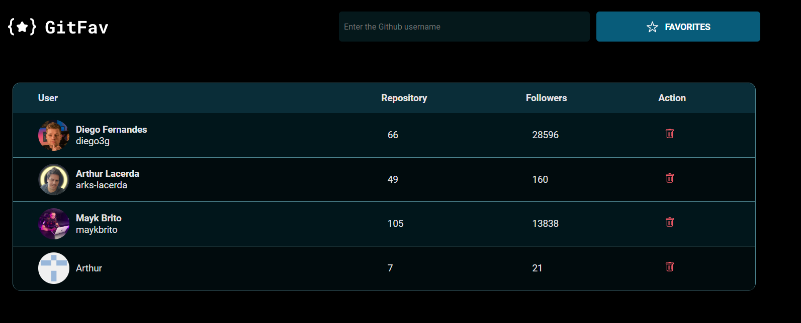

# GitFav | Project - Rocketseat Explorer Program

Developing an application for bookmarking GitHub bookmarks.

✨ Click [HERE]() to access the project

 

> ## 📝 Concept addressed
>
>  

- API
- OOP Concepts
- Immutability to work with application data
- Classes
- Heritage
- Polymorphism
- Creating HTML with JavaScript
- Static methods and promises
- Destructuring in JavaScript
- LocalStorage
- Setting accessibility with Screen Reader Only
- Async Await
- Taking care of the flow of the application with try, catch, throw
- method filter()
- Building tables in HTML
- fetch()

 

> ## 🖥️ Technologies
>
>  

- HTML5
- CSS3
- JavaScript
